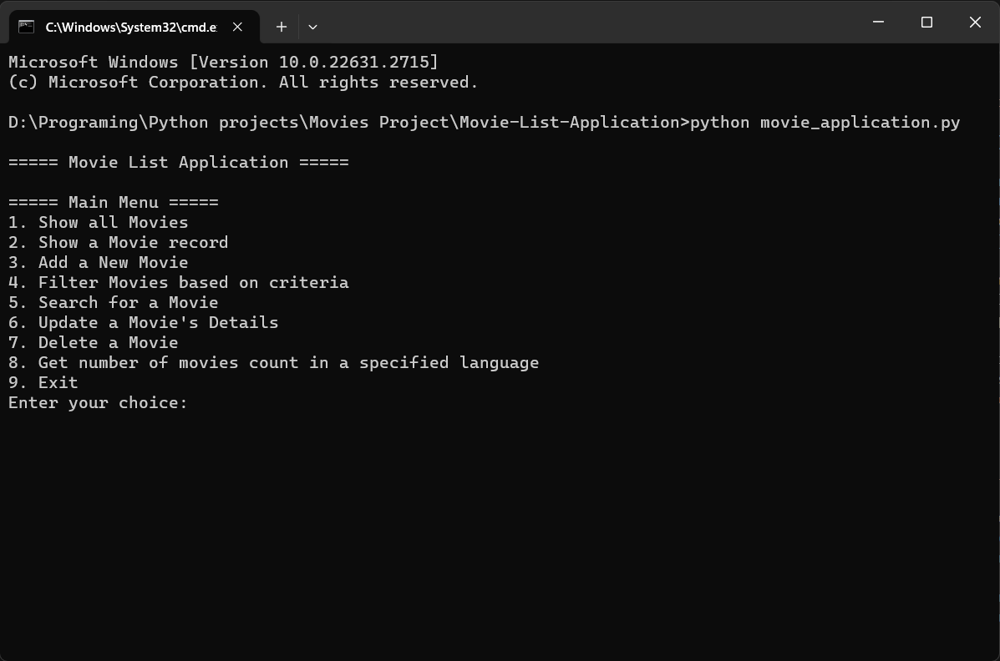

<br/>
<p align="center">
  <h3 align="center">Movie List Application</h3>

  <p align="center">
    Console-Based Movie List Application
    <br/>
    <br/>
  </p>
</p>

  

## Table Of Contents

* [About the Project](#about-the-project)
* [Built With](#built-with)
* [Getting Started](#getting-started)
  * [Prerequisites](#prerequisites)
  * [Installation](#installation)
* [Usage](#usage)

## About The Project



The Movie List Application is a Python-based tool designed for individuals and enthusiasts interested in organizing and managing their movie collections. This console-based program allows users to effortlessly add, view, filter, search, update, and delete movie records. Whether you're a movie buff or someone looking to organize your film library, this application provides an intuitive interface to streamline movie management tasks efficiently.

## Built With

Built with Python: Utilizes Python programming language for the core logic and functionality. Employs JSON for data storage and retrieval.

## Getting Started

This is an example of how you may give instructions on setting up your project locally.
To get a local copy up and running follow these simple example steps.

### Prerequisites

Python: Make sure you have Python installed. You can download it from the official Python website.

Text Editor or IDE: Choose a text editor or an integrated development environment (IDE) to work with the Python code. Examples include VSCode, PyCharm, Atom, or Sublime Text.

### Installation

1. Clone the Repository:
```git clone https://github.com/sasankpenugonda/movie-list-application.git```

3. Navigate to the Directory:
```cd movie-list-application```

4. Execute the Python script to start the application:
```python movie_application.py```

## Usage

To use the Movie List Application:

1. Run the Python script movie_application.py using the command:
python movie_application.py

2. Main Menu Options:
* Choose options from the displayed menu to perform various operations: Show all movies, add a new movie, filter movies, search for a movie, update a movie's details, delete a movie, or get the count of movies in a specified language.


### Creating A Pull Request

1. Fork the Project
2. Create your Feature Branch
3. Commit your Changes
4. Push to the Branch
5. Open a Pull Request
